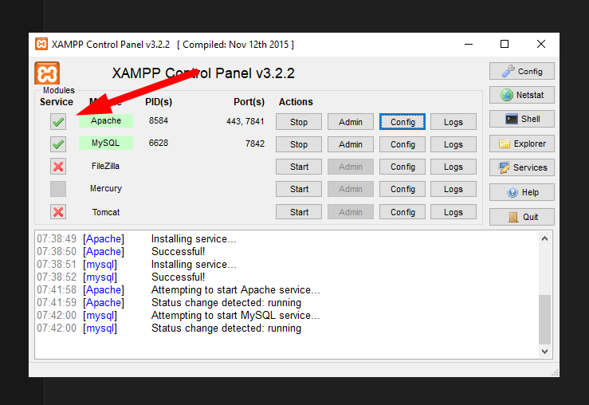
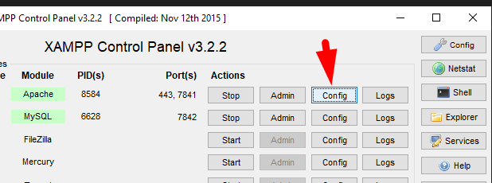
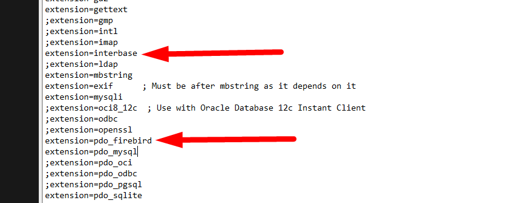
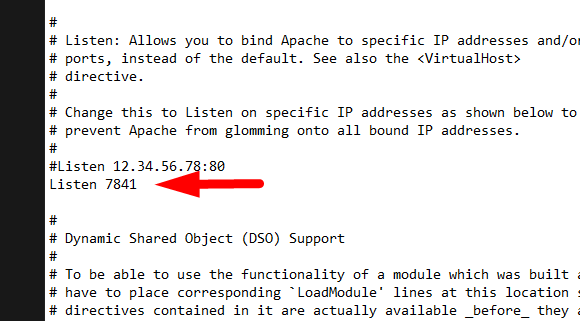
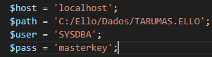

# Configuração do Ambiente para Consulta de Preços - Firebird

Este projeto permite consultar preços de produtos salvos em um banco de dados Firebird através de uma interface PHP.

## 🔧 Requisitos

- Sistema Operacional: Windows  
- PHP: **7.3.0**  
- Servidor: Apache (via XAMPP)  
- Banco de dados: Firebird  
- Navegador Web

## ⚠️ Importante

É **obrigatório utilizar a versão 7.3.0 do XAMPP**, pois versões superiores não incluem a `php_interbase.dll`, necessária para conectar ao Firebird.

## 📁 Estrutura de Pastas

- `c:/xampp/htdocs/` → onde você colocará o `index.php` e `style.css`  
- `consulta-preco-ello/imagens/` → imagens de ajuda visual usadas neste guia

## 🤩 Passo a Passo da Instalação

### 1. Instale o XAMPP 7.3.0

  xampp-win32-7.3.0-0-VC15-installer.exe
  ```
- Marque apenas **Apache** e **PHP**, ou deixe tudo marcado
- No fim da instalação, **desmarque** a opção de iniciar o aplicativo automaticamente
- Conclua a instalação e depois **execute como administrador** o XAMPP

### 2. Ative os Serviços

- Marque os checkbox de **Apache** para instalar como serviço e iniciar junto com o Windows:

  

### 3. Edite o `php.ini`

- Clique em `Config` e depois em `php.ini`:

  

- Remova o ponto e vírgula (;) das extensões abaixo:
  ```ini
  extension=pdo_firebird
  extension=interbase
  ```

  

- Salve e feche o arquivo

### 4. Altere a Porta do Apache (opcional)

- Ainda no XAMPP, clique em `Config` > `httpd.conf`:

  

- Altere a porta `Listen 80` para outra como `8080` se quiser evitar conflitos

### 5. Configure o Projeto

- Acesse `C:\xampp\htdocs`, apague o que tiver dentro e copie:
  - `index.php`
  - `style.css`

- Edite o `index.php` e ajuste o caminho do banco de dados:

  

> **Obs:** Altere somente a parte do caminho. Evite modificar outras partes do arquivo.

---

Pronto! Acesse seu projeto via navegador em:
```
http://localhost
```
ou
```
http://localhost:8080
``` (caso tenha alterado a porta).

